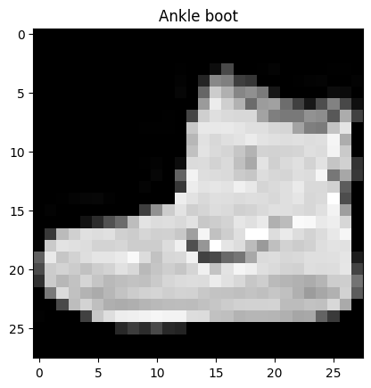
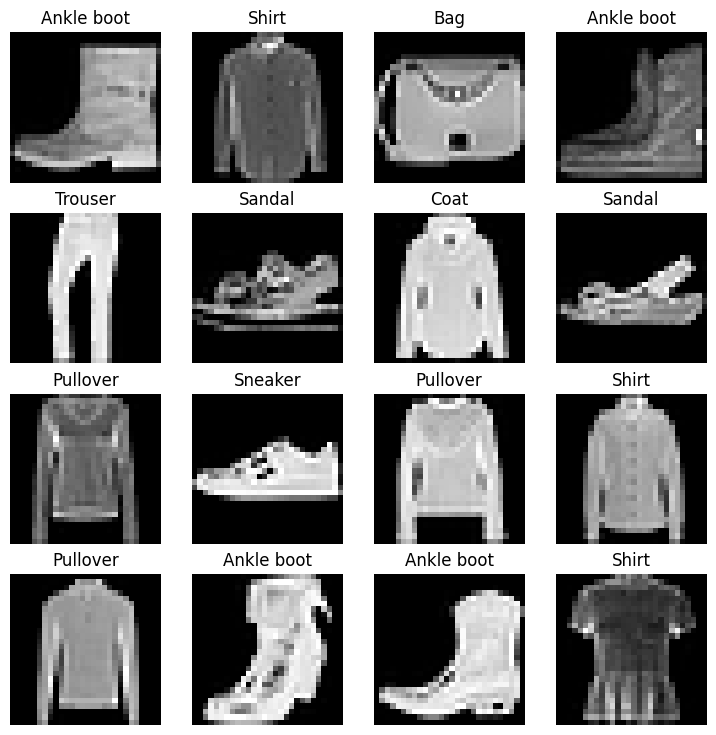

# Comparison of Fashion MNIST on Pytorch using 3 models

# Model 0: base model without non-linearity

# Model 1: base model with Non Linear activation functions are added(with non linearity)

# Model 2: CNN --> Tiny VGG Architecture from https://poloclub.github.io/cnn-explainer/
Input layer -> [Convolutional layer -> activation layer -> pooling layer] -> Output layer


```python
!nvidia-smi
```

    Fri Jun  9 12:30:18 2023       
    +-----------------------------------------------------------------------------+
    | NVIDIA-SMI 525.85.12    Driver Version: 525.85.12    CUDA Version: 12.0     |
    |-------------------------------+----------------------+----------------------+
    | GPU  Name        Persistence-M| Bus-Id        Disp.A | Volatile Uncorr. ECC |
    | Fan  Temp  Perf  Pwr:Usage/Cap|         Memory-Usage | GPU-Util  Compute M. |
    |                               |                      |               MIG M. |
    |===============================+======================+======================|
    |   0  Tesla T4            Off  | 00000000:00:04.0 Off |                    0 |
    | N/A   76C    P0    32W /  70W |   1125MiB / 15360MiB |      0%      Default |
    |                               |                      |                  N/A |
    +-------------------------------+----------------------+----------------------+
                                                                                   
    +-----------------------------------------------------------------------------+
    | Processes:                                                                  |
    |  GPU   GI   CI        PID   Type   Process name                  GPU Memory |
    |        ID   ID                                                   Usage      |
    |=============================================================================|
    +-----------------------------------------------------------------------------+


```python
import torch
from torch import nn

```


```python
import torchvision
from torchvision import datasets
from torchvision import transforms
from torchvision.transforms import ToTensor
```


```python
import matplotlib.pyplot as plt
```


```python
from torchvision import datasets

train_data = datasets.FashionMNIST(root='data',
                                  train = True,
                                  download=True,
                                  transform=torchvision.transforms.ToTensor(),
                                  target_transform=None)

test_data = datasets.FashionMNIST(root='data',
                                 train = False,
                                 download = True,
                                 transform=ToTensor(),
                                 target_transform=None)
```


```python
class_name=train_data.classes
train_data.class_to_idx
```


    {'T-shirt/top': 0,
     'Trouser': 1,
     'Pullover': 2,
     'Dress': 3,
     'Coat': 4,
     'Sandal': 5,
     'Shirt': 6,
     'Sneaker': 7,
     'Bag': 8,
     'Ankle boot': 9}


```python
train_data.targets

```


    tensor([9, 0, 0,  ..., 3, 0, 5])


```python
image, label = train_data[0]
image
```


    tensor([[[0.0000, 0.0000, 0.0000, 0.0000, 0.0000, 0.0000, 0.0000, 0.0000,
              0.0000, 0.0000, 0.0000, 0.0000, 0.0000, 0.0000, 0.0000, 0.0000,
              0.0000, 0.0000, 0.0000, 0.0000, 0.0000, 0.0000, 0.0000, 0.0000,
              0.0000, 0.0000, 0.0000, 0.0000],
             [0.0000, 0.0000, 0.0000, 0.0000, 0.0000, 0.0000, 0.0000, 0.0000,
              0.0000, 0.0000, 0.0000, 0.0000, 0.0000, 0.0000, 0.0000, 0.0000,
              0.0000, 0.0000, 0.0000, 0.0000, 0.0000, 0.0000, 0.0000, 0.0000,
              0.0000, 0.0000, 0.0000, 0.0000],
             [0.0000, 0.0000, 0.0000, 0.0000, 0.0000, 0.0000, 0.0000, 0.0000,
              0.0000, 0.0000, 0.0000, 0.0000, 0.0000, 0.0000, 0.0000, 0.0000,
              0.0000, 0.0000, 0.0000, 0.0000, 0.0000, 0.0000, 0.0000, 0.0000,
              0.0000, 0.0000, 0.0000, 0.0000],
             [0.0000, 0.0000, 0.0000, 0.0000, 0.0000, 0.0000, 0.0000, 0.0000,
              0.0000, 0.0000, 0.0000, 0.0000, 0.0039, 0.0000, 0.0000, 0.0510,
              0.2863, 0.0000, 0.0000, 0.0039, 0.0157, 0.0000, 0.0000, 0.0000,
              0.0000, 0.0039, 0.0039, 0.0000],
             [0.0000, 0.0000, 0.0000, 0.0000, 0.0000, 0.0000, 0.0000, 0.0000,
              0.0000, 0.0000, 0.0000, 0.0000, 0.0118, 0.0000, 0.1412, 0.5333,
              0.4980, 0.2431, 0.2118, 0.0000, 0.0000, 0.0000, 0.0039, 0.0118,
              0.0157, 0.0000, 0.0000, 0.0118],
             [0.0000, 0.0000, 0.0000, 0.0000, 0.0000, 0.0000, 0.0000, 0.0000,
              0.0000, 0.0000, 0.0000, 0.0000, 0.0235, 0.0000, 0.4000, 0.8000,
              0.6902, 0.5255, 0.5647, 0.4824, 0.0902, 0.0000, 0.0000, 0.0000,
              0.0000, 0.0471, 0.0392, 0.0000],
             [0.0000, 0.0000, 0.0000, 0.0000, 0.0000, 0.0000, 0.0000, 0.0000,
              0.0000, 0.0000, 0.0000, 0.0000, 0.0000, 0.0000, 0.6078, 0.9255,
              0.8118, 0.6980, 0.4196, 0.6118, 0.6314, 0.4275, 0.2510, 0.0902,
              0.3020, 0.5098, 0.2824, 0.0588],
             [0.0000, 0.0000, 0.0000, 0.0000, 0.0000, 0.0000, 0.0000, 0.0000,
              0.0000, 0.0000, 0.0000, 0.0039, 0.0000, 0.2706, 0.8118, 0.8745,
              0.8549, 0.8471, 0.8471, 0.6392, 0.4980, 0.4745, 0.4784, 0.5725,
              0.5529, 0.3451, 0.6745, 0.2588],
             [0.0000, 0.0000, 0.0000, 0.0000, 0.0000, 0.0000, 0.0000, 0.0000,
              0.0000, 0.0039, 0.0039, 0.0039, 0.0000, 0.7843, 0.9098, 0.9098,
              0.9137, 0.8980, 0.8745, 0.8745, 0.8431, 0.8353, 0.6431, 0.4980,
              0.4824, 0.7686, 0.8980, 0.0000],
             [0.0000, 0.0000, 0.0000, 0.0000, 0.0000, 0.0000, 0.0000, 0.0000,
              0.0000, 0.0000, 0.0000, 0.0000, 0.0000, 0.7176, 0.8824, 0.8471,
              0.8745, 0.8941, 0.9216, 0.8902, 0.8784, 0.8706, 0.8784, 0.8667,
              0.8745, 0.9608, 0.6784, 0.0000],
             [0.0000, 0.0000, 0.0000, 0.0000, 0.0000, 0.0000, 0.0000, 0.0000,
              0.0000, 0.0000, 0.0000, 0.0000, 0.0000, 0.7569, 0.8941, 0.8549,
              0.8353, 0.7765, 0.7059, 0.8314, 0.8235, 0.8275, 0.8353, 0.8745,
              0.8627, 0.9529, 0.7922, 0.0000],
             [0.0000, 0.0000, 0.0000, 0.0000, 0.0000, 0.0000, 0.0000, 0.0000,
              0.0000, 0.0039, 0.0118, 0.0000, 0.0471, 0.8588, 0.8627, 0.8314,
              0.8549, 0.7529, 0.6627, 0.8902, 0.8157, 0.8549, 0.8784, 0.8314,
              0.8863, 0.7725, 0.8196, 0.2039],
             [0.0000, 0.0000, 0.0000, 0.0000, 0.0000, 0.0000, 0.0000, 0.0000,
              0.0000, 0.0000, 0.0235, 0.0000, 0.3882, 0.9569, 0.8706, 0.8627,
              0.8549, 0.7961, 0.7765, 0.8667, 0.8431, 0.8353, 0.8706, 0.8627,
              0.9608, 0.4667, 0.6549, 0.2196],
             [0.0000, 0.0000, 0.0000, 0.0000, 0.0000, 0.0000, 0.0000, 0.0000,
              0.0000, 0.0157, 0.0000, 0.0000, 0.2157, 0.9255, 0.8941, 0.9020,
              0.8941, 0.9412, 0.9098, 0.8353, 0.8549, 0.8745, 0.9176, 0.8510,
              0.8510, 0.8196, 0.3608, 0.0000],
             [0.0000, 0.0000, 0.0039, 0.0157, 0.0235, 0.0275, 0.0078, 0.0000,
              0.0000, 0.0000, 0.0000, 0.0000, 0.9294, 0.8863, 0.8510, 0.8745,
              0.8706, 0.8588, 0.8706, 0.8667, 0.8471, 0.8745, 0.8980, 0.8431,
              0.8549, 1.0000, 0.3020, 0.0000],
             [0.0000, 0.0118, 0.0000, 0.0000, 0.0000, 0.0000, 0.0000, 0.0000,
              0.0000, 0.2431, 0.5686, 0.8000, 0.8941, 0.8118, 0.8353, 0.8667,
              0.8549, 0.8157, 0.8275, 0.8549, 0.8784, 0.8745, 0.8588, 0.8431,
              0.8784, 0.9569, 0.6235, 0.0000],
             [0.0000, 0.0000, 0.0000, 0.0000, 0.0706, 0.1725, 0.3216, 0.4196,
              0.7412, 0.8941, 0.8627, 0.8706, 0.8510, 0.8863, 0.7843, 0.8039,
              0.8275, 0.9020, 0.8784, 0.9176, 0.6902, 0.7373, 0.9804, 0.9725,
              0.9137, 0.9333, 0.8431, 0.0000],
             [0.0000, 0.2235, 0.7333, 0.8157, 0.8784, 0.8667, 0.8784, 0.8157,
              0.8000, 0.8392, 0.8157, 0.8196, 0.7843, 0.6235, 0.9608, 0.7569,
              0.8078, 0.8745, 1.0000, 1.0000, 0.8667, 0.9176, 0.8667, 0.8275,
              0.8627, 0.9098, 0.9647, 0.0000],
             [0.0118, 0.7922, 0.8941, 0.8784, 0.8667, 0.8275, 0.8275, 0.8392,
              0.8039, 0.8039, 0.8039, 0.8627, 0.9412, 0.3137, 0.5882, 1.0000,
              0.8980, 0.8667, 0.7373, 0.6039, 0.7490, 0.8235, 0.8000, 0.8196,
              0.8706, 0.8941, 0.8824, 0.0000],
             [0.3843, 0.9137, 0.7765, 0.8235, 0.8706, 0.8980, 0.8980, 0.9176,
              0.9765, 0.8627, 0.7608, 0.8431, 0.8510, 0.9451, 0.2549, 0.2863,
              0.4157, 0.4588, 0.6588, 0.8588, 0.8667, 0.8431, 0.8510, 0.8745,
              0.8745, 0.8784, 0.8980, 0.1137],
             [0.2941, 0.8000, 0.8314, 0.8000, 0.7569, 0.8039, 0.8275, 0.8824,
              0.8471, 0.7255, 0.7725, 0.8078, 0.7765, 0.8353, 0.9412, 0.7647,
              0.8902, 0.9608, 0.9373, 0.8745, 0.8549, 0.8314, 0.8196, 0.8706,
              0.8627, 0.8667, 0.9020, 0.2627],
             [0.1882, 0.7961, 0.7176, 0.7608, 0.8353, 0.7725, 0.7255, 0.7451,
              0.7608, 0.7529, 0.7922, 0.8392, 0.8588, 0.8667, 0.8627, 0.9255,
              0.8824, 0.8471, 0.7804, 0.8078, 0.7294, 0.7098, 0.6941, 0.6745,
              0.7098, 0.8039, 0.8078, 0.4510],
             [0.0000, 0.4784, 0.8588, 0.7569, 0.7020, 0.6706, 0.7176, 0.7686,
              0.8000, 0.8235, 0.8353, 0.8118, 0.8275, 0.8235, 0.7843, 0.7686,
              0.7608, 0.7490, 0.7647, 0.7490, 0.7765, 0.7529, 0.6902, 0.6118,
              0.6549, 0.6941, 0.8235, 0.3608],
             [0.0000, 0.0000, 0.2902, 0.7412, 0.8314, 0.7490, 0.6863, 0.6745,
              0.6863, 0.7098, 0.7255, 0.7373, 0.7412, 0.7373, 0.7569, 0.7765,
              0.8000, 0.8196, 0.8235, 0.8235, 0.8275, 0.7373, 0.7373, 0.7608,
              0.7529, 0.8471, 0.6667, 0.0000],
             [0.0078, 0.0000, 0.0000, 0.0000, 0.2588, 0.7843, 0.8706, 0.9294,
              0.9373, 0.9490, 0.9647, 0.9529, 0.9569, 0.8667, 0.8627, 0.7569,
              0.7490, 0.7020, 0.7137, 0.7137, 0.7098, 0.6902, 0.6510, 0.6588,
              0.3882, 0.2275, 0.0000, 0.0000],
             [0.0000, 0.0000, 0.0000, 0.0000, 0.0000, 0.0000, 0.0000, 0.1569,
              0.2392, 0.1725, 0.2824, 0.1608, 0.1373, 0.0000, 0.0000, 0.0000,
              0.0000, 0.0000, 0.0000, 0.0000, 0.0000, 0.0000, 0.0000, 0.0000,
              0.0000, 0.0000, 0.0000, 0.0000],
             [0.0000, 0.0000, 0.0000, 0.0000, 0.0000, 0.0000, 0.0000, 0.0000,
              0.0000, 0.0000, 0.0000, 0.0000, 0.0000, 0.0000, 0.0000, 0.0000,
              0.0000, 0.0000, 0.0000, 0.0000, 0.0000, 0.0000, 0.0000, 0.0000,
              0.0000, 0.0000, 0.0000, 0.0000],
             [0.0000, 0.0000, 0.0000, 0.0000, 0.0000, 0.0000, 0.0000, 0.0000,
              0.0000, 0.0000, 0.0000, 0.0000, 0.0000, 0.0000, 0.0000, 0.0000,
              0.0000, 0.0000, 0.0000, 0.0000, 0.0000, 0.0000, 0.0000, 0.0000,
              0.0000, 0.0000, 0.0000, 0.0000]]])


```python
image.shape
```


    torch.Size([1, 28, 28])


```python

plt.imshow(image.squeeze(), cmap='gray')
plt.title(class_name[label])
```


    Text(0.5, 1.0, 'Ankle boot')


    

    


```python
#plot more images

torch.manual_seed(42)

fig = plt.figure(figsize=(9,9))
rows, cols = 4,4
for i in range(1, rows*cols+1):
  random_idx =  torch.randint(0, len(train_data),size=[1]).item()
  img, label = train_data[random_idx]
  fig.add_subplot(rows,cols,i)
  plt.imshow(img.squeeze(), cmap = 'gray')
  plt.title(class_name[label])
  plt.axis(False);


```


    

    


Dataloaders----> turn data into mini Batches


```python
from torch.utils.data import DataLoader
train_dataloader = DataLoader(dataset = train_data,batch_size=32, shuffle=True)
test_dataloader = DataLoader(dataset = test_data,batch_size=32, shuffle=False)
train_dataloader,test_dataloader
```


    (<torch.utils.data.dataloader.DataLoader at 0x7fd571eaf070>,
     <torch.utils.data.dataloader.DataLoader at 0x7fd571eaee90>)


```python
len(train_dataloader)
```


    1875


```python
train_features_batch, train_labels_batch = next(iter(train_dataloader))
train_features_batch
```


    tensor([[[[0.0000, 0.0000, 0.0000,  ..., 0.0000, 0.0000, 0.0000],
              [0.0000, 0.0000, 0.0000,  ..., 0.0000, 0.0000, 0.0000],
              [0.0000, 0.0000, 0.0000,  ..., 0.0000, 0.0000, 0.0000],
              ...,
              [0.0000, 0.0000, 0.0000,  ..., 0.0157, 0.0000, 0.0039],
              [0.0000, 0.0000, 0.0000,  ..., 0.0000, 0.0000, 0.0000],
              [0.0000, 0.0000, 0.0000,  ..., 0.0000, 0.0000, 0.0000]]],
    
    
            [[[0.0000, 0.0000, 0.0000,  ..., 0.0000, 0.0000, 0.0000],
              [0.0000, 0.0000, 0.0000,  ..., 0.0000, 0.0000, 0.0000],
              [0.0000, 0.0000, 0.0000,  ..., 0.0000, 0.0000, 0.0000],
              ...,
              [0.0000, 0.0000, 0.0000,  ..., 0.0000, 0.0000, 0.0000],
              [0.0000, 0.0000, 0.0000,  ..., 0.0000, 0.0000, 0.0000],
              [0.0000, 0.0000, 0.0000,  ..., 0.0000, 0.0000, 0.0000]]],
    
    
            [[[0.0000, 0.0000, 0.0000,  ..., 0.0000, 0.0000, 0.0000],
              [0.0000, 0.0000, 0.0000,  ..., 0.0000, 0.0000, 0.0000],
              [0.0000, 0.0000, 0.0000,  ..., 0.0000, 0.0000, 0.0000],
              ...,
              [0.0000, 0.0000, 0.0000,  ..., 0.0000, 0.0078, 0.0000],
              [0.0000, 0.0000, 0.0000,  ..., 0.0000, 0.0000, 0.0000],
              [0.0000, 0.0000, 0.0000,  ..., 0.0000, 0.0000, 0.0000]]],
    
    
            ...,
    
    
            [[[0.0000, 0.0000, 0.0000,  ..., 0.0000, 0.0000, 0.0000],
              [0.0000, 0.0000, 0.0000,  ..., 0.0000, 0.0000, 0.0000],
              [0.0000, 0.0000, 0.0000,  ..., 0.0000, 0.0000, 0.0000],
              ...,
              [0.0000, 0.0000, 0.0000,  ..., 0.0000, 0.0000, 0.0000],
              [0.0000, 0.0000, 0.0000,  ..., 0.0000, 0.0000, 0.0000],
              [0.0000, 0.0000, 0.0000,  ..., 0.0000, 0.0000, 0.0000]]],
    
    
            [[[0.0000, 0.0000, 0.0000,  ..., 0.0000, 0.0000, 0.0000],
              [0.0000, 0.0000, 0.0000,  ..., 0.0000, 0.0000, 0.0000],
              [0.0000, 0.0000, 0.0000,  ..., 0.0000, 0.0000, 0.0000],
              ...,
              [0.0000, 0.0000, 0.0000,  ..., 0.0000, 0.0000, 0.0000],
              [0.0000, 0.0000, 0.0000,  ..., 0.0000, 0.0000, 0.0000],
              [0.0000, 0.0000, 0.0000,  ..., 0.0000, 0.0000, 0.0000]]],
    
    
            [[[0.0000, 0.0000, 0.0000,  ..., 0.0000, 0.0000, 0.0000],
              [0.0000, 0.0000, 0.0000,  ..., 0.0000, 0.0000, 0.0000],
              [0.0000, 0.0000, 0.0000,  ..., 0.0000, 0.0000, 0.0000],
              ...,
              [0.0000, 0.0000, 0.0000,  ..., 0.0000, 0.0000, 0.0000],
              [0.0000, 0.0000, 0.0000,  ..., 0.0000, 0.0000, 0.0000],
              [0.0000, 0.0000, 0.0000,  ..., 0.0000, 0.0000, 0.0000]]]])


```python
torch.manual_seed(64)
random_idx = torch.randint(0, len(train_features_batch),size=[1]).item()
img, label = train_features_batch[random_idx], train_labels_batch[random_idx]
plt.imshow(img.squeeze(),cmap = 'gray')
plt.title(class_name[label])
plt.axis(False)
print(f"Image Size: {img.shape}")
print(f"Label:{label},label size:{label.shape}")
```

    Image Size: torch.Size([1, 28, 28])
    Label:5,label size:torch.Size([])


    

    


# Model_0: Baseline model


```python
flatten_model = nn.Flatten()

x = train_features_batch[0]

output = flatten_model(x)

print(f"shape before flattening {x.shape}")
print(f"shape after flattening {output.shape}")
```

    shape before flattening torch.Size([1, 28, 28])
    shape after flattening torch.Size([1, 784])


```python
from torch import nn

class Fashionmodel_V0(nn.Module):
  def __init__(self,input_shape: int,hidden_units: int,output_shape: int):
    super().__init__()
    self.layer_stack = nn.Sequential(nn.Flatten(),
                                     nn.Linear(in_features=input_shape,out_features=hidden_units),
                                     nn.Linear(in_features=hidden_units,out_features=output_shape)
                                     )

  def forward(self, x):
    return self.layer_stack(x)


```


```python
torch.manual_seed(64)
model_0 = Fashionmodel_V0(input_shape=784, hidden_units=8 , output_shape=len(class_name)).to("cpu")
model_0
```


    Fashionmodel_V0(
      (layer_stack): Sequential(
        (0): Flatten(start_dim=1, end_dim=-1)
        (1): Linear(in_features=784, out_features=8, bias=True)
        (2): Linear(in_features=8, out_features=10, bias=True)
      )
    )


```python
rand = torch.rand([1,1,28,28])
model_0(rand)
```


    tensor([[-0.2880, -0.1511,  0.1973,  0.2939,  0.5272,  0.0556, -0.2915, -0.1170,
              0.1006, -0.0987]], grad_fn=<AddmmBackward0>)


```python
 model_0.state_dict()
```


    OrderedDict([('layer_stack.1.weight',
                  tensor([[-0.0322,  0.0071, -0.0231,  ...,  0.0220,  0.0202,  0.0228],
                          [-0.0071,  0.0200,  0.0212,  ...,  0.0344, -0.0145,  0.0339],
                          [ 0.0288, -0.0138,  0.0009,  ...,  0.0320, -0.0183,  0.0252],
                          ...,
                          [ 0.0270,  0.0037,  0.0139,  ...,  0.0210,  0.0279,  0.0007],
                          [-0.0026,  0.0172, -0.0295,  ..., -0.0146, -0.0316,  0.0231],
                          [ 0.0005, -0.0263, -0.0094,  ..., -0.0219,  0.0224,  0.0078]])),
                 ('layer_stack.1.bias',
                  tensor([-0.0183,  0.0020,  0.0049,  0.0276, -0.0304,  0.0222, -0.0265,  0.0062])),
                 ('layer_stack.2.weight',
                  tensor([[ 0.2958, -0.1539, -0.0041, -0.2944, -0.1206, -0.0991,  0.3207,  0.2780],
                          [ 0.2439,  0.1354, -0.0397, -0.1511, -0.3463, -0.2436,  0.1335,  0.1234],
                          [-0.2730, -0.2063, -0.1952, -0.0389,  0.2323,  0.0961,  0.0255,  0.1251],
                          [ 0.2703, -0.2026,  0.2904,  0.1641, -0.0448, -0.1196, -0.2097, -0.2679],
                          [ 0.1474,  0.1964,  0.2168, -0.0171, -0.0331,  0.2031, -0.1648,  0.2508],
                          [ 0.1034, -0.0282, -0.2678, -0.2966, -0.0164, -0.3429, -0.2815, -0.0572],
                          [ 0.2541, -0.1981,  0.2407,  0.1769,  0.1425, -0.0401, -0.1698, -0.2555],
                          [-0.0870,  0.3191,  0.1595, -0.0092,  0.0484,  0.0778,  0.3061,  0.0842],
                          [-0.2667, -0.3067,  0.2639, -0.0678, -0.1638,  0.0767, -0.3325, -0.0126],
                          [-0.1337, -0.0673,  0.0546,  0.2608,  0.1099, -0.2626,  0.0252, -0.2941]])),
                 ('layer_stack.2.bias',
                  tensor([-0.1978, -0.1658,  0.2918,  0.2761,  0.2558,  0.0692, -0.2546, -0.1021,
                          -0.1281,  0.1102]))])


# Accuracy Function - Helper function


```python
def accuracy_fn(y_true, y_pred):
    """Calculates accuracy between truth labels and predictions.

    Args:
        y_true (torch.Tensor): Truth labels for predictions.
        y_pred (torch.Tensor): Predictions to be compared to predictions.

    Returns:
        [torch.float]: Accuracy value between y_true and y_pred, e.g. 78.45
    """
    correct = torch.eq(y_true, y_pred).sum().item()
    acc = (correct / len(y_pred)) * 100
    return acc

```

# Setup Loss and Optimizer


```python
loss_fn = nn.CrossEntropyLoss()
optimizer = torch.optim.SGD(params= model_0.parameters(),lr = 0.1)

```


```python
from timeit import default_timer as timer
def print_train_time(start: float, end:float, device: torch.device = None):
  total_time = end - start
  print(f"Train time on {device}: {total_time:.3f} seconds")
  return total_time


```


```python
start_time = timer()
"""
some code
"""
end_time = timer()

print_train_time(start=start_time, end = end_time, device = "cpu")

```

    Train time on cpu: 0.000 seconds


    8.493800032738363e-05


# Training Loop


```python
from tqdm.auto import tqdm

torch.manual_seed(64)
start_time_cpu = timer()

epochs = 3

for epoch in tqdm(range(epochs)):
  print(f"Epoch: {epoch}\n-----")
  train_loss = 0
  for batch, (X, y) in enumerate(train_dataloader):
    model_0.train()
    #forward pass
    y_pred = model_0(X)

    loss = loss_fn(y_pred, y)
    train_loss += loss

    optimizer.zero_grad()

    loss.backward()

    optimizer.step()


    if batch % 400 == 0:
     print(f"Looked at {batch * len(X)}/{len(train_dataloader.dataset)}samples.")

  train_loss /= len(train_dataloader)
  test_loss, test_acc = 0,0

  model_0.eval()
  with torch.inference_mode():
    for X_test, y_test in test_dataloader:
      test_pred = model_0(X_test) #forward pass
      test_loss += loss_fn(test_pred,y_test) #calculate loss (accumatively)
      test_acc +=  accuracy_fn(y_true = y_test, y_pred=test_pred.argmax(dim=1)) # calculate accuracy
    test_loss /= len(test_dataloader)
    test_acc /= len(test_dataloader)

  print(f"\ntrain loss: {train_loss:.4f} | Test loss :{test_loss:.4f}, Test acc: {test_acc:.4f}")

train_time_end_on_cpu = timer()
total_train_time_model_0 = print_train_time(start=start_time_cpu,
                                            end=train_time_end_on_cpu,
                                            device=str(next(model_0.parameters()).device))


```


      0%|          | 0/3 [00:00<?, ?it/s]


    Epoch: 0
    -----
    Looked at 0/60000samples.
    Looked at 12800/60000samples.
    Looked at 25600/60000samples.
    Looked at 38400/60000samples.
    Looked at 51200/60000samples.
    
    train loss: 0.5955 | Test loss :0.5212, Test acc: 81.7692
    Epoch: 1
    -----
    Looked at 0/60000samples.
    Looked at 12800/60000samples.
    Looked at 25600/60000samples.
    Looked at 38400/60000samples.
    Looked at 51200/60000samples.
    
    train loss: 0.4866 | Test loss :0.4823, Test acc: 83.4165
    Epoch: 2
    -----
    Looked at 0/60000samples.
    Looked at 12800/60000samples.
    Looked at 25600/60000samples.
    Looked at 38400/60000samples.
    Looked at 51200/60000samples.
    
    train loss: 0.4639 | Test loss :0.4873, Test acc: 83.0771
    Train time on cpu: 31.106 seconds


```python
str(next(model_0.parameters()).device)
```


    'cpu'


# Make Prediction and get model_0 results


```python
torch.manual_seed(13)
def eval_model(model: torch.nn.Module,
               data_loader: torch.utils.data.DataLoader,
               loss_fn: torch.nn.Module,
               accuracy_fn):
  """Returns a dictionary containing the results of model predicting on data_loader."""
  loss, acc = 0,0
  model.eval()
  with torch.inference_mode():
    for X,y in tqdm(data_loader):
      y_pred = model(X)

      loss += loss_fn(y_pred, y)
      acc += accuracy_fn(y_true = y, y_pred = y_pred.argmax(dim=1))


    loss /= len(data_loader)
    acc /= len(data_loader)

  return{"model_name": model.__class__.__name__,# only works when model was created with a class
         "model_loss": loss.item(),
         "model_acc": acc
         }

model_0_results = eval_model(model=model_0,
                             data_loader=test_dataloader,
                             loss_fn=loss_fn,
                             accuracy_fn=accuracy_fn)
model_0_results


```


      0%|          | 0/313 [00:00<?, ?it/s]


    {'model_name': 'Fashionmodel_V0',
     'model_loss': 0.4872579276561737,
     'model_acc': 83.0770766773163}


# setup device agnostic code


```python
torch.cuda.is_available()
# Setup device-agnostic code
import torch
device = "cuda" if torch.cuda.is_available() else "cpu"
device
```


    'cuda'


model_1: Model with non linearity


```python
class Fashionmodel_V1(nn.Module):
  def __init__(self,input_shape: int,hidden_units: int,output_shape: int):
    super().__init__()
    self.layer_stack = nn.Sequential(nn.Flatten(),
                                     nn.Linear(in_features=input_shape,out_features=hidden_units),
                                     nn.ReLU(),
                                     nn.Linear(in_features=hidden_units,out_features=output_shape),
                                     nn.ReLU(),
                                     )

  def forward(self, x: torch.Tensor):
    return self.layer_stack(x)

```


```python
torch.manual_seed(13)
model_1 = Fashionmodel_V1(input_shape = 784,
                          hidden_units=10,
                          output_shape = len(class_name)).to(device)

next(model_1.parameters()).device

```


    device(type='cuda', index=0)


Setup loss, optimizer and evaluation metrics


```python
loss_fn = nn.CrossEntropyLoss() # measure how wrong our model is
optimizer = torch.optim.SGD(params=model_1.parameters(), # tries to update our model's parameters to reduce the loss
                            lr=0.1)
```

# Functionizing training and evaluation/testing loops

## Train Step


```python
def train_step(model: torch.nn.Module,
               data_loader: torch.utils.data.DataLoader,
               loss_fn: torch.nn.Module,
               optimizer: torch.optim.Optimizer,
               accuracy_fn,
               device: torch.device = device):
  train_loss,train_acc = 0,0
  model.train()

  for batch , (X,y) in enumerate(data_loader):

    X,y = X.to(device), y.to(device) # put data on target device -GPU cuda

    y_pred = model(X) #Forward pass (outputs the raw logits from the model)

    loss = loss_fn(y_pred, y) #Calculate loss and accuracy (per batch)

    train_loss += loss ## accumulate train loss
    train_acc += accuracy_fn(y_true = y, y_pred = y_pred.argmax(dim=1)) # go from logits -> prediction labels


    optimizer.zero_grad()

    loss.backward()

    optimizer.step()

  train_loss /= len(data_loader)
  train_acc /= len(data_loader)

  print(f"Train Loss: {train_loss:.5f}, Train Accuracy: {train_acc:.2f}%")


```

## Test Step


```python
def test_step(model: torch.nn.Module,
               data_loader: torch.utils.data.DataLoader,
               loss_fn: torch.nn.Module,
               accuracy_fn,
               device: torch.device = device):
  test_loss,test_acc = 0,0
  model.eval()

  with torch.inference_mode():
    for X, y in data_loader:
       X,y = X.to(device), y.to(device) # put data on target device -GPU cuda

       test_pred = model(X) #Forward pass (outputs the raw logits from the model)

       loss = loss_fn(test_pred, y) #Calculate loss and accuracy (per batch)

       test_loss += loss ## accumulate train loss
       test_acc += accuracy_fn(y_true = y, y_pred = test_pred.argmax(dim=1)) # go from logits -> prediction labels

    test_loss /= len(data_loader)
    test_acc/= len(data_loader)
    print(f"\nTest Loss: {test_loss:.5f}, Test Accuracy: {test_acc:.2f}%\n")
```


```python
torch.manual_seed(13)

from timeit import default_timer as timer
train_time_start_on_gpu = timer()


epochs = 3

for epoch in tqdm(range(epochs)):
  print(f"Epoch: {epoch}\n------")
  train_step(model = model_1,
             data_loader = train_dataloader,
             loss_fn = loss_fn,
             optimizer = optimizer,
             accuracy_fn = accuracy_fn,
             device=device)
  test_step(model = model_1,
             data_loader = test_dataloader,
             loss_fn = loss_fn,
             accuracy_fn = accuracy_fn,
             device=device)

train_time_end_on_gpu = timer()
total_train_time_model_1 = print_train_time(start=train_time_start_on_gpu,
                                            end=train_time_end_on_gpu,
                                            device=device)

```


      0%|          | 0/3 [00:00<?, ?it/s]


    Epoch: 0
    ------
    Train Loss: 0.93703, Train Accuracy: 65.40%
    
    Test Loss: 0.77074, Test Accuracy: 71.93%
    
    Epoch: 1
    ------
    Train Loss: 0.69496, Train Accuracy: 73.73%
    
    Test Loss: 0.69765, Test Accuracy: 73.10%
    
    Epoch: 2
    ------
    Train Loss: 0.66225, Train Accuracy: 74.98%
    
    Test Loss: 0.70476, Test Accuracy: 73.75%
    
    Train time on cuda: 34.778 seconds


```python
torch.manual_seed(13)
def eval_model(model: torch.nn.Module,
               data_loader: torch.utils.data.DataLoader,
               loss_fn: torch.nn.Module,
               accuracy_fn,
               device=device):
  """Returns a dictionary containing the results of model predicting on data_loader."""
  loss, acc = 0,0
  model.eval()
  with torch.inference_mode():
    for X,y in tqdm(data_loader):
       # Make our data device agnostic
      X, y = X.to(device), y.to(device)
      y_pred = model(X)

      loss += loss_fn(y_pred, y)
      acc += accuracy_fn(y_true = y, y_pred = y_pred.argmax(dim=1))


    loss /= len(data_loader)
    acc /= len(data_loader)

  return{"model_name": model.__class__.__name__,# only works when model was created with a class
         "model_loss": loss.item(),
         "model_acc": acc
         }

model_1_results = eval_model(model=model_1,
                             data_loader=test_dataloader,
                             loss_fn=loss_fn,
                             accuracy_fn=accuracy_fn,
                             device=device)
model_1_results


```


      0%|          | 0/313 [00:00<?, ?it/s]


    {'model_name': 'Fashionmodel_V1',
     'model_loss': 0.704755961894989,
     'model_acc': 73.75199680511182}


# Comparison of models with and without non linearity


```python
import plotly.graph_objects as go
from plotly.subplots import make_subplots


# Create subplots, 2 rows, 1 column
fig = make_subplots(rows=2, cols=1)

# Add trace for accuracy
fig.add_trace(go.Bar(x=[model_1_results['model_name'], model_0_results['model_name']],
                     y=[model_1_results['model_acc'], model_0_results['model_acc']],
                     name='Model Accuracy'),
              row=1, col=1)

# Add trace for loss
fig.add_trace(go.Bar(x=[model_1_results['model_name'], model_0_results['model_name']],
                     y=[model_1_results['model_loss'], model_0_results['model_loss']],
                     name='Model Loss'),
              row=2, col=1)

# Update xaxis properties
fig.update_xaxes(title_text="Model Name", row=1, col=1)
fig.update_xaxes(title_text="Model Name", row=2, col=1)

# Update yaxis properties
fig.update_yaxes(title_text="Model Accuracy", row=1, col=1)
fig.update_yaxes(title_text="Model Loss", row=2, col=1)

# Update title and size
fig.update_layout(title_text="Comparison of Model Accuracy and Loss", height=700)

fig.show()

```


<html>
<head><meta charset="utf-8" /></head>
<body>
    <div>            <script src="https://cdnjs.cloudflare.com/ajax/libs/mathjax/2.7.5/MathJax.js?config=TeX-AMS-MML_SVG"></script><script type="text/javascript">if (window.MathJax && window.MathJax.Hub && window.MathJax.Hub.Config) {window.MathJax.Hub.Config({SVG: {font: "STIX-Web"}});}</script>                <script type="text/javascript">window.PlotlyConfig = {MathJaxConfig: 'local'};</script>
        <script src="https://cdn.plot.ly/plotly-2.18.2.min.js"></script>                <div id="b1d5b093-b234-4deb-86fd-0bb9b107dfd4" class="plotly-graph-div" style="height:700px; width:100%;"></div>            <script type="text/javascript">                                    window.PLOTLYENV=window.PLOTLYENV || {};                                    if (document.getElementById("b1d5b093-b234-4deb-86fd-0bb9b107dfd4")) {                    Plotly.newPlot(                        "b1d5b093-b234-4deb-86fd-0bb9b107dfd4",                        [{"name":"Model Accuracy","x":["Fashionmodel_V1","Fashionmodel_V0"],"y":[73.75199680511182,83.0770766773163],"type":"bar","xaxis":"x","yaxis":"y"},{"name":"Model Loss","x":["Fashionmodel_V1","Fashionmodel_V0"],"y":[0.704755961894989,0.4872579276561737],"type":"bar","xaxis":"x2","yaxis":"y2"}],                        {"template":{"data":{"histogram2dcontour":[{"type":"histogram2dcontour","colorbar":{"outlinewidth":0,"ticks":""},"colorscale":[[0.0,"#0d0887"],[0.1111111111111111,"#46039f"],[0.2222222222222222,"#7201a8"],[0.3333333333333333,"#9c179e"],[0.4444444444444444,"#bd3786"],[0.5555555555555556,"#d8576b"],[0.6666666666666666,"#ed7953"],[0.7777777777777778,"#fb9f3a"],[0.8888888888888888,"#fdca26"],[1.0,"#f0f921"]]}],"choropleth":[{"type":"choropleth","colorbar":{"outlinewidth":0,"ticks":""}}],"histogram2d":[{"type":"histogram2d","colorbar":{"outlinewidth":0,"ticks":""},"colorscale":[[0.0,"#0d0887"],[0.1111111111111111,"#46039f"],[0.2222222222222222,"#7201a8"],[0.3333333333333333,"#9c179e"],[0.4444444444444444,"#bd3786"],[0.5555555555555556,"#d8576b"],[0.6666666666666666,"#ed7953"],[0.7777777777777778,"#fb9f3a"],[0.8888888888888888,"#fdca26"],[1.0,"#f0f921"]]}],"heatmap":[{"type":"heatmap","colorbar":{"outlinewidth":0,"ticks":""},"colorscale":[[0.0,"#0d0887"],[0.1111111111111111,"#46039f"],[0.2222222222222222,"#7201a8"],[0.3333333333333333,"#9c179e"],[0.4444444444444444,"#bd3786"],[0.5555555555555556,"#d8576b"],[0.6666666666666666,"#ed7953"],[0.7777777777777778,"#fb9f3a"],[0.8888888888888888,"#fdca26"],[1.0,"#f0f921"]]}],"heatmapgl":[{"type":"heatmapgl","colorbar":{"outlinewidth":0,"ticks":""},"colorscale":[[0.0,"#0d0887"],[0.1111111111111111,"#46039f"],[0.2222222222222222,"#7201a8"],[0.3333333333333333,"#9c179e"],[0.4444444444444444,"#bd3786"],[0.5555555555555556,"#d8576b"],[0.6666666666666666,"#ed7953"],[0.7777777777777778,"#fb9f3a"],[0.8888888888888888,"#fdca26"],[1.0,"#f0f921"]]}],"contourcarpet":[{"type":"contourcarpet","colorbar":{"outlinewidth":0,"ticks":""}}],"contour":[{"type":"contour","colorbar":{"outlinewidth":0,"ticks":""},"colorscale":[[0.0,"#0d0887"],[0.1111111111111111,"#46039f"],[0.2222222222222222,"#7201a8"],[0.3333333333333333,"#9c179e"],[0.4444444444444444,"#bd3786"],[0.5555555555555556,"#d8576b"],[0.6666666666666666,"#ed7953"],[0.7777777777777778,"#fb9f3a"],[0.8888888888888888,"#fdca26"],[1.0,"#f0f921"]]}],"surface":[{"type":"surface","colorbar":{"outlinewidth":0,"ticks":""},"colorscale":[[0.0,"#0d0887"],[0.1111111111111111,"#46039f"],[0.2222222222222222,"#7201a8"],[0.3333333333333333,"#9c179e"],[0.4444444444444444,"#bd3786"],[0.5555555555555556,"#d8576b"],[0.6666666666666666,"#ed7953"],[0.7777777777777778,"#fb9f3a"],[0.8888888888888888,"#fdca26"],[1.0,"#f0f921"]]}],"mesh3d":[{"type":"mesh3d","colorbar":{"outlinewidth":0,"ticks":""}}],"scatter":[{"fillpattern":{"fillmode":"overlay","size":10,"solidity":0.2},"type":"scatter"}],"parcoords":[{"type":"parcoords","line":{"colorbar":{"outlinewidth":0,"ticks":""}}}],"scatterpolargl":[{"type":"scatterpolargl","marker":{"colorbar":{"outlinewidth":0,"ticks":""}}}],"bar":[{"error_x":{"color":"#2a3f5f"},"error_y":{"color":"#2a3f5f"},"marker":{"line":{"color":"#E5ECF6","width":0.5},"pattern":{"fillmode":"overlay","size":10,"solidity":0.2}},"type":"bar"}],"scattergeo":[{"type":"scattergeo","marker":{"colorbar":{"outlinewidth":0,"ticks":""}}}],"scatterpolar":[{"type":"scatterpolar","marker":{"colorbar":{"outlinewidth":0,"ticks":""}}}],"histogram":[{"marker":{"pattern":{"fillmode":"overlay","size":10,"solidity":0.2}},"type":"histogram"}],"scattergl":[{"type":"scattergl","marker":{"colorbar":{"outlinewidth":0,"ticks":""}}}],"scatter3d":[{"type":"scatter3d","line":{"colorbar":{"outlinewidth":0,"ticks":""}},"marker":{"colorbar":{"outlinewidth":0,"ticks":""}}}],"scattermapbox":[{"type":"scattermapbox","marker":{"colorbar":{"outlinewidth":0,"ticks":""}}}],"scatterternary":[{"type":"scatterternary","marker":{"colorbar":{"outlinewidth":0,"ticks":""}}}],"scattercarpet":[{"type":"scattercarpet","marker":{"colorbar":{"outlinewidth":0,"ticks":""}}}],"carpet":[{"aaxis":{"endlinecolor":"#2a3f5f","gridcolor":"white","linecolor":"white","minorgridcolor":"white","startlinecolor":"#2a3f5f"},"baxis":{"endlinecolor":"#2a3f5f","gridcolor":"white","linecolor":"white","minorgridcolor":"white","startlinecolor":"#2a3f5f"},"type":"carpet"}],"table":[{"cells":{"fill":{"color":"#EBF0F8"},"line":{"color":"white"}},"header":{"fill":{"color":"#C8D4E3"},"line":{"color":"white"}},"type":"table"}],"barpolar":[{"marker":{"line":{"color":"#E5ECF6","width":0.5},"pattern":{"fillmode":"overlay","size":10,"solidity":0.2}},"type":"barpolar"}],"pie":[{"automargin":true,"type":"pie"}]},"layout":{"autotypenumbers":"strict","colorway":["#636efa","#EF553B","#00cc96","#ab63fa","#FFA15A","#19d3f3","#FF6692","#B6E880","#FF97FF","#FECB52"],"font":{"color":"#2a3f5f"},"hovermode":"closest","hoverlabel":{"align":"left"},"paper_bgcolor":"white","plot_bgcolor":"#E5ECF6","polar":{"bgcolor":"#E5ECF6","angularaxis":{"gridcolor":"white","linecolor":"white","ticks":""},"radialaxis":{"gridcolor":"white","linecolor":"white","ticks":""}},"ternary":{"bgcolor":"#E5ECF6","aaxis":{"gridcolor":"white","linecolor":"white","ticks":""},"baxis":{"gridcolor":"white","linecolor":"white","ticks":""},"caxis":{"gridcolor":"white","linecolor":"white","ticks":""}},"coloraxis":{"colorbar":{"outlinewidth":0,"ticks":""}},"colorscale":{"sequential":[[0.0,"#0d0887"],[0.1111111111111111,"#46039f"],[0.2222222222222222,"#7201a8"],[0.3333333333333333,"#9c179e"],[0.4444444444444444,"#bd3786"],[0.5555555555555556,"#d8576b"],[0.6666666666666666,"#ed7953"],[0.7777777777777778,"#fb9f3a"],[0.8888888888888888,"#fdca26"],[1.0,"#f0f921"]],"sequentialminus":[[0.0,"#0d0887"],[0.1111111111111111,"#46039f"],[0.2222222222222222,"#7201a8"],[0.3333333333333333,"#9c179e"],[0.4444444444444444,"#bd3786"],[0.5555555555555556,"#d8576b"],[0.6666666666666666,"#ed7953"],[0.7777777777777778,"#fb9f3a"],[0.8888888888888888,"#fdca26"],[1.0,"#f0f921"]],"diverging":[[0,"#8e0152"],[0.1,"#c51b7d"],[0.2,"#de77ae"],[0.3,"#f1b6da"],[0.4,"#fde0ef"],[0.5,"#f7f7f7"],[0.6,"#e6f5d0"],[0.7,"#b8e186"],[0.8,"#7fbc41"],[0.9,"#4d9221"],[1,"#276419"]]},"xaxis":{"gridcolor":"white","linecolor":"white","ticks":"","title":{"standoff":15},"zerolinecolor":"white","automargin":true,"zerolinewidth":2},"yaxis":{"gridcolor":"white","linecolor":"white","ticks":"","title":{"standoff":15},"zerolinecolor":"white","automargin":true,"zerolinewidth":2},"scene":{"xaxis":{"backgroundcolor":"#E5ECF6","gridcolor":"white","linecolor":"white","showbackground":true,"ticks":"","zerolinecolor":"white","gridwidth":2},"yaxis":{"backgroundcolor":"#E5ECF6","gridcolor":"white","linecolor":"white","showbackground":true,"ticks":"","zerolinecolor":"white","gridwidth":2},"zaxis":{"backgroundcolor":"#E5ECF6","gridcolor":"white","linecolor":"white","showbackground":true,"ticks":"","zerolinecolor":"white","gridwidth":2}},"shapedefaults":{"line":{"color":"#2a3f5f"}},"annotationdefaults":{"arrowcolor":"#2a3f5f","arrowhead":0,"arrowwidth":1},"geo":{"bgcolor":"white","landcolor":"#E5ECF6","subunitcolor":"white","showland":true,"showlakes":true,"lakecolor":"white"},"title":{"x":0.05},"mapbox":{"style":"light"}}},"xaxis":{"anchor":"y","domain":[0.0,1.0],"title":{"text":"Model Name"}},"yaxis":{"anchor":"x","domain":[0.575,1.0],"title":{"text":"Model Accuracy"}},"xaxis2":{"anchor":"y2","domain":[0.0,1.0],"title":{"text":"Model Name"}},"yaxis2":{"anchor":"x2","domain":[0.0,0.425],"title":{"text":"Model Loss"}},"title":{"text":"Comparison of Model Accuracy and Loss"},"height":700},                        {"responsive": true}                    ).then(function(){

var gd = document.getElementById('b1d5b093-b234-4deb-86fd-0bb9b107dfd4');
var x = new MutationObserver(function (mutations, observer) {{
        var display = window.getComputedStyle(gd).display;
        if (!display || display === 'none') {{
            console.log([gd, 'removed!']);
            Plotly.purge(gd);
            observer.disconnect();
        }}
}});

// Listen for the removal of the full notebook cells
var notebookContainer = gd.closest('#notebook-container');
if (notebookContainer) {{
    x.observe(notebookContainer, {childList: true});
}}

// Listen for the clearing of the current output cell
var outputEl = gd.closest('.output');
if (outputEl) {{
    x.observe(outputEl, {childList: true});
}}

                        })                };                            </script>        </div>
</body>
</html>


Model 2: Convolution Neural Network


```python
class Fashionmodel_V2(nn.Module):
  def __init__(self, input_shape: int, hidden_units: int, output_shape: int):

    super().__init__()
    self.conv_block1 = nn.Sequential(
        nn.Conv2d(in_channels=input_shape,
                  out_channels=hidden_units,
                  kernel_size=3,
                  stride = 1,
                  padding = 1),
        nn.ReLU(),
        nn.Conv2d(in_channels=hidden_units,
                  out_channels=hidden_units,
                  kernel_size=3,
                  stride = 1,
                  padding = 1),
        nn.ReLU(),
        nn.MaxPool2d(kernel_size = 2)
    )
    self.conv_block2 = nn.Sequential(
        nn.Conv2d(in_channels=hidden_units,
                  out_channels=hidden_units,
                  kernel_size=3,
                  stride = 1,
                  padding = 1),
        nn.ReLU(),
        nn.Conv2d(in_channels=hidden_units,
                  out_channels=hidden_units,
                  kernel_size=3,
                  stride = 1,
                  padding = 1),
        nn.ReLU(),
        nn.MaxPool2d(kernel_size = 2)
    )
    self.classifier = nn.Sequential(
        nn.Flatten(),
        nn.Linear(in_features = hidden_units*7*7,
                  out_features = output_shape)
    )

  def forward(self, x):
    x = self.conv_block1(x)
    # print(f"Output shape of conv_block_1: {x.shape}") #to test random image tensor
    x = self.conv_block2(x)
    # print(f"Output shape of conv_block_2: {x.shape}")#to test random image tensor
    x = self.classifier(x)
    # print(f"Output shape of classifier: {x.shape}")#to test random image tensor
    return x
```


```python
torch.manual_seed(13)
model_2 = Fashionmodel_V2(input_shape = 1,
                          hidden_units=10,
                          output_shape = len(class_name)).to(device)

```

test a random image tensor


```python
rand_image_tensor = torch.randn(size=(1, 28, 28))
rand_image_tensor=rand_image_tensor.unsqueeze(0)
```


```python
# Pass image through model
model_2(rand_image_tensor.to(device))
```


    tensor([[ 0.0225, -0.0429, -0.0594, -0.2037, -0.0441,  0.0834, -0.0077, -0.0445,
             -0.0346, -0.0063]], device='cuda:0', grad_fn=<AddmmBackward0>)


```python
loss_fn = nn.CrossEntropyLoss()

optimizer = torch.optim.SGD(params = model_2.parameters(),lr=0.1)


```


```python
torch.manual_seed(13)
torch.cuda.manual_seed(13)

# Measure time
from timeit import default_timer as timer
train_time_start_model_2 = timer()


epochs = 3

for epoch in tqdm(range(epochs)):
  print(f"Epoch: {epoch}\n-------")
  train_step(model=model_2,
             data_loader = train_dataloader,
             loss_fn=loss_fn,
             optimizer = optimizer,
             accuracy_fn = accuracy_fn,
             device = device
             )
  test_step(model=model_2,
            data_loader = test_dataloader,
            loss_fn=loss_fn ,
            accuracy_fn = accuracy_fn,
            device = device)

  train_time_end_model_2 = timer()
  total_train_time_model_2 = print_train_time(start=train_time_start_model_2,
                                            end=train_time_end_model_2,
                                            device=device)


```


      0%|          | 0/3 [00:00<?, ?it/s]


    Epoch: 0
    -------
    Train Loss: 0.60728, Train Accuracy: 77.97%
    
    Test Loss: 0.46914, Test Accuracy: 82.94%
    
    Train time on cuda: 13.625 seconds
    Epoch: 1
    -------
    Train Loss: 0.35047, Train Accuracy: 87.42%
    
    Test Loss: 0.34225, Test Accuracy: 87.70%
    
    Train time on cuda: 27.036 seconds
    Epoch: 2
    -------
    Train Loss: 0.30718, Train Accuracy: 88.93%
    
    Test Loss: 0.34033, Test Accuracy: 88.13%
    
    Train time on cuda: 40.143 seconds


```python
model_2_results = eval_model(
     model=model_2,
     data_loader=test_dataloader,
     loss_fn=loss_fn,
     accuracy_fn=accuracy_fn,
     device=device
)

model_2_results
```


      0%|          | 0/313 [00:00<?, ?it/s]


    {'model_name': 'Fashionmodel_V2',
     'model_loss': 0.34033453464508057,
     'model_acc': 88.12899361022365}


Compare model results and training time


```python
import pandas as pd
compare_results = pd.DataFrame([model_0_results,
                                model_1_results,
                                model_2_results])
# Add training time to results comparison
compare_results["training_time"] = [total_train_time_model_0,
                                    total_train_time_model_1,
                                    total_train_time_model_2]
compare_results
```


  <div id="df-53dfd71a-0e3a-4f1d-86d5-b74086a2d220">
    <div class="colab-df-container">
      <div>
<style scoped>
    .dataframe tbody tr th:only-of-type {
        vertical-align: middle;
    }

    .dataframe tbody tr th {
        vertical-align: top;
    }

    .dataframe thead th {
        text-align: right;
    }
</style>
<table border="1" class="dataframe">
  <thead>
    <tr style="text-align: right;">
      <th></th>
      <th>model_name</th>
      <th>model_loss</th>
      <th>model_acc</th>
      <th>training_time</th>
    </tr>
  </thead>
  <tbody>
    <tr>
      <th>0</th>
      <td>Fashionmodel_V0</td>
      <td>0.487258</td>
      <td>83.077077</td>
      <td>31.105863</td>
    </tr>
    <tr>
      <th>1</th>
      <td>Fashionmodel_V1</td>
      <td>0.704756</td>
      <td>73.751997</td>
      <td>34.777630</td>
    </tr>
    <tr>
      <th>2</th>
      <td>Fashionmodel_V2</td>
      <td>0.340335</td>
      <td>88.128994</td>
      <td>40.143163</td>
    </tr>
  </tbody>
</table>
</div>
      <button class="colab-df-convert" onclick="convertToInteractive('df-53dfd71a-0e3a-4f1d-86d5-b74086a2d220')"
              title="Convert this dataframe to an interactive table."
              style="display:none;">

  <svg xmlns="http://www.w3.org/2000/svg" height="24px"viewBox="0 0 24 24"
       width="24px">
    <path d="M0 0h24v24H0V0z" fill="none"/>
    <path d="M18.56 5.44l.94 2.06.94-2.06 2.06-.94-2.06-.94-.94-2.06-.94 2.06-2.06.94zm-11 1L8.5 8.5l.94-2.06 2.06-.94-2.06-.94L8.5 2.5l-.94 2.06-2.06.94zm10 10l.94 2.06.94-2.06 2.06-.94-2.06-.94-.94-2.06-.94 2.06-2.06.94z"/><path d="M17.41 7.96l-1.37-1.37c-.4-.4-.92-.59-1.43-.59-.52 0-1.04.2-1.43.59L10.3 9.45l-7.72 7.72c-.78.78-.78 2.05 0 2.83L4 21.41c.39.39.9.59 1.41.59.51 0 1.02-.2 1.41-.59l7.78-7.78 2.81-2.81c.8-.78.8-2.07 0-2.86zM5.41 20L4 18.59l7.72-7.72 1.47 1.35L5.41 20z"/>
  </svg>
      </button>

  <style>
    .colab-df-container {
      display:flex;
      flex-wrap:wrap;
      gap: 12px;
    }

    .colab-df-convert {
      background-color: #E8F0FE;
      border: none;
      border-radius: 50%;
      cursor: pointer;
      display: none;
      fill: #1967D2;
      height: 32px;
      padding: 0 0 0 0;
      width: 32px;
    }

    .colab-df-convert:hover {
      background-color: #E2EBFA;
      box-shadow: 0px 1px 2px rgba(60, 64, 67, 0.3), 0px 1px 3px 1px rgba(60, 64, 67, 0.15);
      fill: #174EA6;
    }

    [theme=dark] .colab-df-convert {
      background-color: #3B4455;
      fill: #D2E3FC;
    }

    [theme=dark] .colab-df-convert:hover {
      background-color: #434B5C;
      box-shadow: 0px 1px 3px 1px rgba(0, 0, 0, 0.15);
      filter: drop-shadow(0px 1px 2px rgba(0, 0, 0, 0.3));
      fill: #FFFFFF;
    }
  </style>

      <script>
        const buttonEl =
          document.querySelector('#df-53dfd71a-0e3a-4f1d-86d5-b74086a2d220 button.colab-df-convert');
        buttonEl.style.display =
          google.colab.kernel.accessAllowed ? 'block' : 'none';

        async function convertToInteractive(key) {
          const element = document.querySelector('#df-53dfd71a-0e3a-4f1d-86d5-b74086a2d220');
          const dataTable =
            await google.colab.kernel.invokeFunction('convertToInteractive',
                                                     [key], {});
          if (!dataTable) return;

          const docLinkHtml = 'Like what you see? Visit the ' +
            '<a target="_blank" href=https://colab.research.google.com/notebooks/data_table.ipynb>data table notebook</a>'
            + ' to learn more about interactive tables.';
          element.innerHTML = '';
          dataTable['output_type'] = 'display_data';
          await google.colab.output.renderOutput(dataTable, element);
          const docLink = document.createElement('div');
          docLink.innerHTML = docLinkHtml;
          element.appendChild(docLink);
        }
      </script>
    </div>
  </div>


Visualize Models


```python
import plotly.subplots as sp
import plotly.graph_objects as go

# Create subplots: 3 rows, 1 column
fig = sp.make_subplots(rows=3, cols=1)

# Add traces
fig.add_trace(go.Scatter(x=compare_results['model_name'], y=compare_results['model_loss'], mode='lines+markers', name='model_loss'), row=1, col=1)
fig.add_trace(go.Scatter(x=compare_results['model_name'], y=compare_results['model_acc'], mode='lines+markers', name='model_acc'), row=2, col=1)
fig.add_trace(go.Scatter(x=compare_results['model_name'], y=compare_results['training_time'], mode='lines+markers', name='training_time'), row=3, col=1)

# Update yaxis properties
fig.update_yaxes(title_text="Model Loss", row=1, col=1)
fig.update_yaxes(title_text="Model Accuracy", row=2, col=1)
fig.update_yaxes(title_text="Training Time", row=3, col=1)

# Update layout
fig.update_layout(height=600, width=600, title_text="Model Comparison")

# Show plot
fig.show()
```


<html>
<head><meta charset="utf-8" /></head>
<body>
    <div>            <script src="https://cdnjs.cloudflare.com/ajax/libs/mathjax/2.7.5/MathJax.js?config=TeX-AMS-MML_SVG"></script><script type="text/javascript">if (window.MathJax && window.MathJax.Hub && window.MathJax.Hub.Config) {window.MathJax.Hub.Config({SVG: {font: "STIX-Web"}});}</script>                <script type="text/javascript">window.PlotlyConfig = {MathJaxConfig: 'local'};</script>
        <script src="https://cdn.plot.ly/plotly-2.18.2.min.js"></script>                <div id="2dad7633-39dd-4edf-9e61-cd480b9a4a2e" class="plotly-graph-div" style="height:600px; width:600px;"></div>            <script type="text/javascript">                                    window.PLOTLYENV=window.PLOTLYENV || {};                                    if (document.getElementById("2dad7633-39dd-4edf-9e61-cd480b9a4a2e")) {                    Plotly.newPlot(                        "2dad7633-39dd-4edf-9e61-cd480b9a4a2e",                        [{"mode":"lines+markers","name":"model_loss","x":["Fashionmodel_V0","Fashionmodel_V1","Fashionmodel_V2"],"y":[0.4872579276561737,0.704755961894989,0.34033453464508057],"type":"scatter","xaxis":"x","yaxis":"y"},{"mode":"lines+markers","name":"model_acc","x":["Fashionmodel_V0","Fashionmodel_V1","Fashionmodel_V2"],"y":[83.0770766773163,73.75199680511182,88.12899361022365],"type":"scatter","xaxis":"x2","yaxis":"y2"},{"mode":"lines+markers","name":"training_time","x":["Fashionmodel_V0","Fashionmodel_V1","Fashionmodel_V2"],"y":[31.105862679999518,34.777629528000034,40.14316287800011],"type":"scatter","xaxis":"x3","yaxis":"y3"}],                        {"template":{"data":{"histogram2dcontour":[{"type":"histogram2dcontour","colorbar":{"outlinewidth":0,"ticks":""},"colorscale":[[0.0,"#0d0887"],[0.1111111111111111,"#46039f"],[0.2222222222222222,"#7201a8"],[0.3333333333333333,"#9c179e"],[0.4444444444444444,"#bd3786"],[0.5555555555555556,"#d8576b"],[0.6666666666666666,"#ed7953"],[0.7777777777777778,"#fb9f3a"],[0.8888888888888888,"#fdca26"],[1.0,"#f0f921"]]}],"choropleth":[{"type":"choropleth","colorbar":{"outlinewidth":0,"ticks":""}}],"histogram2d":[{"type":"histogram2d","colorbar":{"outlinewidth":0,"ticks":""},"colorscale":[[0.0,"#0d0887"],[0.1111111111111111,"#46039f"],[0.2222222222222222,"#7201a8"],[0.3333333333333333,"#9c179e"],[0.4444444444444444,"#bd3786"],[0.5555555555555556,"#d8576b"],[0.6666666666666666,"#ed7953"],[0.7777777777777778,"#fb9f3a"],[0.8888888888888888,"#fdca26"],[1.0,"#f0f921"]]}],"heatmap":[{"type":"heatmap","colorbar":{"outlinewidth":0,"ticks":""},"colorscale":[[0.0,"#0d0887"],[0.1111111111111111,"#46039f"],[0.2222222222222222,"#7201a8"],[0.3333333333333333,"#9c179e"],[0.4444444444444444,"#bd3786"],[0.5555555555555556,"#d8576b"],[0.6666666666666666,"#ed7953"],[0.7777777777777778,"#fb9f3a"],[0.8888888888888888,"#fdca26"],[1.0,"#f0f921"]]}],"heatmapgl":[{"type":"heatmapgl","colorbar":{"outlinewidth":0,"ticks":""},"colorscale":[[0.0,"#0d0887"],[0.1111111111111111,"#46039f"],[0.2222222222222222,"#7201a8"],[0.3333333333333333,"#9c179e"],[0.4444444444444444,"#bd3786"],[0.5555555555555556,"#d8576b"],[0.6666666666666666,"#ed7953"],[0.7777777777777778,"#fb9f3a"],[0.8888888888888888,"#fdca26"],[1.0,"#f0f921"]]}],"contourcarpet":[{"type":"contourcarpet","colorbar":{"outlinewidth":0,"ticks":""}}],"contour":[{"type":"contour","colorbar":{"outlinewidth":0,"ticks":""},"colorscale":[[0.0,"#0d0887"],[0.1111111111111111,"#46039f"],[0.2222222222222222,"#7201a8"],[0.3333333333333333,"#9c179e"],[0.4444444444444444,"#bd3786"],[0.5555555555555556,"#d8576b"],[0.6666666666666666,"#ed7953"],[0.7777777777777778,"#fb9f3a"],[0.8888888888888888,"#fdca26"],[1.0,"#f0f921"]]}],"surface":[{"type":"surface","colorbar":{"outlinewidth":0,"ticks":""},"colorscale":[[0.0,"#0d0887"],[0.1111111111111111,"#46039f"],[0.2222222222222222,"#7201a8"],[0.3333333333333333,"#9c179e"],[0.4444444444444444,"#bd3786"],[0.5555555555555556,"#d8576b"],[0.6666666666666666,"#ed7953"],[0.7777777777777778,"#fb9f3a"],[0.8888888888888888,"#fdca26"],[1.0,"#f0f921"]]}],"mesh3d":[{"type":"mesh3d","colorbar":{"outlinewidth":0,"ticks":""}}],"scatter":[{"fillpattern":{"fillmode":"overlay","size":10,"solidity":0.2},"type":"scatter"}],"parcoords":[{"type":"parcoords","line":{"colorbar":{"outlinewidth":0,"ticks":""}}}],"scatterpolargl":[{"type":"scatterpolargl","marker":{"colorbar":{"outlinewidth":0,"ticks":""}}}],"bar":[{"error_x":{"color":"#2a3f5f"},"error_y":{"color":"#2a3f5f"},"marker":{"line":{"color":"#E5ECF6","width":0.5},"pattern":{"fillmode":"overlay","size":10,"solidity":0.2}},"type":"bar"}],"scattergeo":[{"type":"scattergeo","marker":{"colorbar":{"outlinewidth":0,"ticks":""}}}],"scatterpolar":[{"type":"scatterpolar","marker":{"colorbar":{"outlinewidth":0,"ticks":""}}}],"histogram":[{"marker":{"pattern":{"fillmode":"overlay","size":10,"solidity":0.2}},"type":"histogram"}],"scattergl":[{"type":"scattergl","marker":{"colorbar":{"outlinewidth":0,"ticks":""}}}],"scatter3d":[{"type":"scatter3d","line":{"colorbar":{"outlinewidth":0,"ticks":""}},"marker":{"colorbar":{"outlinewidth":0,"ticks":""}}}],"scattermapbox":[{"type":"scattermapbox","marker":{"colorbar":{"outlinewidth":0,"ticks":""}}}],"scatterternary":[{"type":"scatterternary","marker":{"colorbar":{"outlinewidth":0,"ticks":""}}}],"scattercarpet":[{"type":"scattercarpet","marker":{"colorbar":{"outlinewidth":0,"ticks":""}}}],"carpet":[{"aaxis":{"endlinecolor":"#2a3f5f","gridcolor":"white","linecolor":"white","minorgridcolor":"white","startlinecolor":"#2a3f5f"},"baxis":{"endlinecolor":"#2a3f5f","gridcolor":"white","linecolor":"white","minorgridcolor":"white","startlinecolor":"#2a3f5f"},"type":"carpet"}],"table":[{"cells":{"fill":{"color":"#EBF0F8"},"line":{"color":"white"}},"header":{"fill":{"color":"#C8D4E3"},"line":{"color":"white"}},"type":"table"}],"barpolar":[{"marker":{"line":{"color":"#E5ECF6","width":0.5},"pattern":{"fillmode":"overlay","size":10,"solidity":0.2}},"type":"barpolar"}],"pie":[{"automargin":true,"type":"pie"}]},"layout":{"autotypenumbers":"strict","colorway":["#636efa","#EF553B","#00cc96","#ab63fa","#FFA15A","#19d3f3","#FF6692","#B6E880","#FF97FF","#FECB52"],"font":{"color":"#2a3f5f"},"hovermode":"closest","hoverlabel":{"align":"left"},"paper_bgcolor":"white","plot_bgcolor":"#E5ECF6","polar":{"bgcolor":"#E5ECF6","angularaxis":{"gridcolor":"white","linecolor":"white","ticks":""},"radialaxis":{"gridcolor":"white","linecolor":"white","ticks":""}},"ternary":{"bgcolor":"#E5ECF6","aaxis":{"gridcolor":"white","linecolor":"white","ticks":""},"baxis":{"gridcolor":"white","linecolor":"white","ticks":""},"caxis":{"gridcolor":"white","linecolor":"white","ticks":""}},"coloraxis":{"colorbar":{"outlinewidth":0,"ticks":""}},"colorscale":{"sequential":[[0.0,"#0d0887"],[0.1111111111111111,"#46039f"],[0.2222222222222222,"#7201a8"],[0.3333333333333333,"#9c179e"],[0.4444444444444444,"#bd3786"],[0.5555555555555556,"#d8576b"],[0.6666666666666666,"#ed7953"],[0.7777777777777778,"#fb9f3a"],[0.8888888888888888,"#fdca26"],[1.0,"#f0f921"]],"sequentialminus":[[0.0,"#0d0887"],[0.1111111111111111,"#46039f"],[0.2222222222222222,"#7201a8"],[0.3333333333333333,"#9c179e"],[0.4444444444444444,"#bd3786"],[0.5555555555555556,"#d8576b"],[0.6666666666666666,"#ed7953"],[0.7777777777777778,"#fb9f3a"],[0.8888888888888888,"#fdca26"],[1.0,"#f0f921"]],"diverging":[[0,"#8e0152"],[0.1,"#c51b7d"],[0.2,"#de77ae"],[0.3,"#f1b6da"],[0.4,"#fde0ef"],[0.5,"#f7f7f7"],[0.6,"#e6f5d0"],[0.7,"#b8e186"],[0.8,"#7fbc41"],[0.9,"#4d9221"],[1,"#276419"]]},"xaxis":{"gridcolor":"white","linecolor":"white","ticks":"","title":{"standoff":15},"zerolinecolor":"white","automargin":true,"zerolinewidth":2},"yaxis":{"gridcolor":"white","linecolor":"white","ticks":"","title":{"standoff":15},"zerolinecolor":"white","automargin":true,"zerolinewidth":2},"scene":{"xaxis":{"backgroundcolor":"#E5ECF6","gridcolor":"white","linecolor":"white","showbackground":true,"ticks":"","zerolinecolor":"white","gridwidth":2},"yaxis":{"backgroundcolor":"#E5ECF6","gridcolor":"white","linecolor":"white","showbackground":true,"ticks":"","zerolinecolor":"white","gridwidth":2},"zaxis":{"backgroundcolor":"#E5ECF6","gridcolor":"white","linecolor":"white","showbackground":true,"ticks":"","zerolinecolor":"white","gridwidth":2}},"shapedefaults":{"line":{"color":"#2a3f5f"}},"annotationdefaults":{"arrowcolor":"#2a3f5f","arrowhead":0,"arrowwidth":1},"geo":{"bgcolor":"white","landcolor":"#E5ECF6","subunitcolor":"white","showland":true,"showlakes":true,"lakecolor":"white"},"title":{"x":0.05},"mapbox":{"style":"light"}}},"xaxis":{"anchor":"y","domain":[0.0,1.0]},"yaxis":{"anchor":"x","domain":[0.7333333333333333,1.0],"title":{"text":"Model Loss"}},"xaxis2":{"anchor":"y2","domain":[0.0,1.0]},"yaxis2":{"anchor":"x2","domain":[0.36666666666666664,0.6333333333333333],"title":{"text":"Model Accuracy"}},"xaxis3":{"anchor":"y3","domain":[0.0,1.0]},"yaxis3":{"anchor":"x3","domain":[0.0,0.26666666666666666],"title":{"text":"Training Time"}},"title":{"text":"Model Comparison"},"height":600,"width":600},                        {"responsive": true}                    ).then(function(){

var gd = document.getElementById('2dad7633-39dd-4edf-9e61-cd480b9a4a2e');
var x = new MutationObserver(function (mutations, observer) {{
        var display = window.getComputedStyle(gd).display;
        if (!display || display === 'none') {{
            console.log([gd, 'removed!']);
            Plotly.purge(gd);
            observer.disconnect();
        }}
}});

// Listen for the removal of the full notebook cells
var notebookContainer = gd.closest('#notebook-container');
if (notebookContainer) {{
    x.observe(notebookContainer, {childList: true});
}}

// Listen for the clearing of the current output cell
var outputEl = gd.closest('.output');
if (outputEl) {{
    x.observe(outputEl, {childList: true});
}}

                        })                };                            </script>        </div>
</body>
</html>


# Make and evaluate random predictions with best model


```python
def make_predictions(model: torch.nn.Module,
                     data:list,
                     device: torch.device = device):
  prediction_probs = []
  model.eval()
  with torch.inference_mode():
    for sample in data:
      sample = torch.unsqueeze(sample, dim = 0).to(device) #add extra dim for conv2d
      pred_logit = model(sample) # Forward Pass (model output raw logits)

      # Get prediction probability (logit -> prediction probability)
      prediction_prob = torch.softmax(pred_logit.squeeze(), dim = 0)

      # Get pred_prob off GPU for further calculations

      prediction_probs.append(prediction_prob.cpu())
  # Stack the pred_probs to turn list into a tensor
  return torch.stack(prediction_probs)

```


```python
import random
random.seed(42)
test_samples = []
test_labels = []
for sample, label in random.sample(list(test_data), k=9):
    test_samples.append(sample)
    test_labels.append(label)

# View the first test sample shape and label
print(f"Test sample image shape: {test_samples[0].shape}\nTest sample label: {test_labels[0]} ({class_name[test_labels[0]]})")
```

    Test sample image shape: torch.Size([1, 28, 28])
    Test sample label: 5 (Sandal)


```python
# Make predictions on test samples with model 2
pred_probs= make_predictions(model=model_2,
                             data=test_samples)

# View first two prediction probabilities list
pred_probs[:2]
```


    tensor([[3.1702e-08, 7.7343e-10, 3.4906e-08, 1.0131e-09, 9.8138e-09, 9.9995e-01,
             4.0244e-07, 1.2042e-05, 2.8320e-06, 3.8170e-05],
            [7.1043e-02, 3.0320e-01, 2.4821e-04, 9.4720e-02, 4.2939e-01, 2.4582e-04,
             8.8939e-02, 1.8468e-03, 9.6836e-03, 6.8257e-04]])


```python
# Turn the prediction probabilities into prediction labels by taking the argmax()
pred_classes = pred_probs.argmax(dim=1)
pred_classes
```


    tensor([5, 4, 7, 4, 3, 0, 4, 7, 1])


```python
test_labels, pred_classes
```


    ([5, 1, 7, 4, 3, 0, 4, 7, 1], tensor([5, 4, 7, 4, 3, 0, 4, 7, 1]))


```python
# Plot predictions
plt.figure(figsize=(9, 9))
nrows = 3
ncols = 3
for i, sample in enumerate(test_samples):
  # Create a subplot
  plt.subplot(nrows, ncols, i+1)

  # Plot the target image
  plt.imshow(sample.squeeze(), cmap="gray")

  # Find the prediction label (in text form, e.g. "Sandal")
  pred_label = class_name[pred_classes[i]]

  # Get the truth label (in text form, e.g. "T-shirt")
  truth_label = class_name[test_labels[i]]

  # Create the title text of the plot
  title_text = f"Pred: {pred_label} | Truth: {truth_label}"

  # Check for equality and change title colour accordingly
  if pred_label == truth_label:
      plt.title(title_text, fontsize=10, c="g") # green text if correct
  else:
      plt.title(title_text, fontsize=10, c="r") # red text if wrong
  plt.axis(False);
```


    

    


## Plot Confusion Matrix --> Make predictions with our trained model, model_2 (a confusion matrix compares predictions to true labels)--> Make a confusion matrix using torchmetrics.ConfusionMatrix --> Plot the confusion matrix using mlxtend.plotting.plot_confusion_matrix().


```python
# Import tqdm for progress bar
from tqdm.auto import tqdm

# 1. Make predictions with trained model
y_preds = []
model_2.eval()
with torch.inference_mode():
  for X, y in tqdm(test_dataloader, desc="Making predictions"):
    # Send data and targets to target device
    X, y = X.to(device), y.to(device)
    # Do the forward pass
    y_logit = model_2(X)
    # Turn predictions from logits -> prediction probabilities -> predictions labels
    y_pred = torch.softmax(y_logit, dim=1).argmax(dim=1)
    # Put predictions on CPU for evaluation
    y_preds.append(y_pred.cpu())
# Concatenate list of predictions into a tensor
y_pred_tensor = torch.cat(y_preds)
```


    Making predictions:   0%|          | 0/313 [00:00<?, ?it/s]


```python
# See if torchmetrics exists, if not, install it
try:
    import torchmetrics, mlxtend
    print(f"mlxtend version: {mlxtend.__version__}")
    assert int(mlxtend.__version__.split(".")[1]) >= 19, "mlxtend verison should be 0.19.0 or higher"
except:
    !pip install -q torchmetrics -U mlxtend # <- Note: If you're using Google Colab, this may require restarting the runtime
    import torchmetrics, mlxtend
    print(f"mlxtend version: {mlxtend.__version__}")
```

          519.2/519.2 kB 18.2 MB/s eta 0:00:00
          1.4/1.4 MB 71.0 MB/s eta 0:00:00
    [?25hmlxtend version: 0.22.0


```python
# Import mlxtend upgraded version
import mlxtend
print(mlxtend.__version__)
assert int(mlxtend.__version__.split(".")[1]) >= 19 # should be version 0.19.0 or higher
```

    0.22.0


```python
from torchmetrics import ConfusionMatrix
from mlxtend.plotting import plot_confusion_matrix

# 2. Setup confusion matrix instance and compare predictions to targets
confmat = ConfusionMatrix(num_classes=len(class_name), task='multiclass')
confmat_tensor = confmat(preds=y_pred_tensor,
                         target=test_data.targets)

# 3. Plot the confusion matrix
fig, ax = plot_confusion_matrix(
    conf_mat=confmat_tensor.numpy(), # matplotlib likes working with NumPy
    class_names=class_name, # turn the row and column labels into class names
    figsize=(10, 7)
);
```


    

    


Save the best performing model


```python
from pathlib import Path

# Create models directory (if it doesn't already exist), see: https://docs.python.org/3/library/pathlib.html#pathlib.Path.mkdir
MODEL_PATH = Path("models")
MODEL_PATH.mkdir(parents=True, # create parent directories if needed
                 exist_ok=True # if models directory already exists, don't error
)

# Create model save path
MODEL_NAME = "Fashion_Mnist_CNN_TinyVGG_Architecture.pth"
MODEL_SAVE_PATH = MODEL_PATH / MODEL_NAME

# Save the model state dict
print(f"Saving model to: {MODEL_SAVE_PATH}")
torch.save(obj=model_2.state_dict(), # only saving the state_dict() only saves the learned parameters
           f=MODEL_SAVE_PATH)
```

    Saving model to: models/Fashion_Mnist_CNN_TinyVGG_Architecture.pth


```python
# Create a new instance of Fashionmodel_V2 (the same class as our saved state_dict())
# Note: loading model will error if the shapes here aren't the same as the saved version
loaded_model_2 = Fashionmodel_V2(input_shape=1,
                                    hidden_units=10, # try changing this to 128 and seeing what happens
                                    output_shape=10)

# Load in the saved state_dict()
loaded_model_2.load_state_dict(torch.load(f=MODEL_SAVE_PATH))

# Send model to GPU
loaded_model_2 = loaded_model_2.to(device)
```


```python
# Create a new instance of Fashionmodel_V2 (the same class as our saved state_dict())
# Note: loading model will error if the shapes here aren't the same as the saved version
loaded_model_2 = Fashionmodel_V2(input_shape=1,
                                    hidden_units=10, # try changing this to 128 and seeing what happens
                                    output_shape=10)

# Load in the saved state_dict()
loaded_model_2.load_state_dict(torch.load(f=MODEL_SAVE_PATH))

# Send model to GPU
loaded_model_2 = loaded_model_2.to(device)
```


```python
# Evaluate loaded model
torch.manual_seed(42)

loaded_model_2_results = eval_model(
    model=loaded_model_2,
    data_loader=test_dataloader,
    loss_fn=loss_fn,
    accuracy_fn=accuracy_fn
)

loaded_model_2_results
```


      0%|          | 0/313 [00:00<?, ?it/s]


    {'model_name': 'Fashionmodel_V2',
     'model_loss': 0.34033453464508057,
     'model_acc': 88.12899361022365}


```python
model_2_results
```


    {'model_name': 'Fashionmodel_V2',
     'model_loss': 0.34033453464508057,
     'model_acc': 88.12899361022365}


Check tensors are close


```python
# Check to see if results are close to each other (if they are very far away, there may be an error)
torch.isclose(torch.tensor(model_2_results["model_loss"]),
              torch.tensor(loaded_model_2_results["model_loss"]),
              atol=1e-08, # absolute tolerance
              rtol=0.0001) # relative tolerance
```


    tensor(True)


